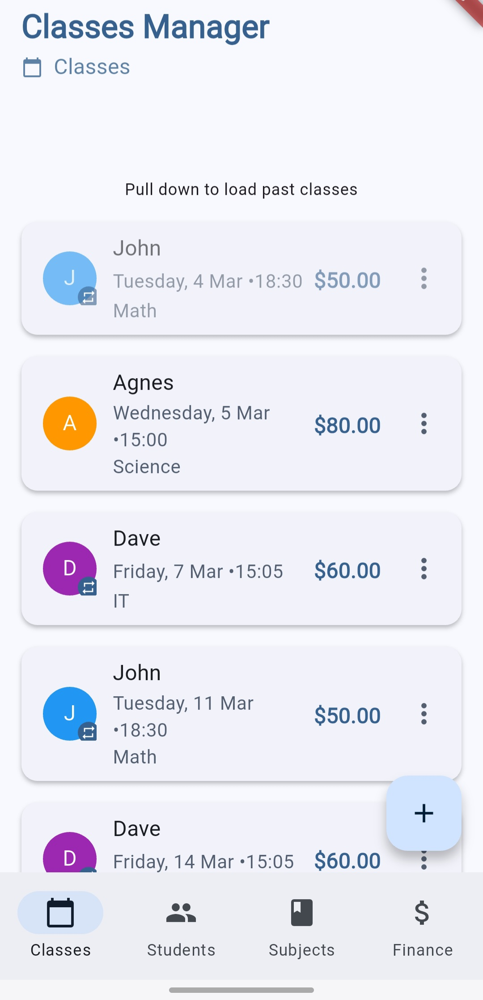

# Classes Manager

A Flutter application for tutors and teachers to manage their private classes, students, and schedules. This app was developed with the assistance of Cursor AI, providing an efficient and modern solution for educational professionals.

## Features

🎓 **Class Management**
- Schedule one-time and recurring classes
- Track class duration and pricing
- Mark classes as completed or cancelled
- View and manage past and upcoming classes
- Edit individual or recurring class series

👥 **Student Management**
- Store and organize student information
- Color-coded student profiles for easy identification
- Track classes per student

📚 **Subject Management**
- Define different subjects
- Set base pricing per hour
- Flexible pricing for different class durations

💰 **Pricing**
- Automatic price calculation based on duration
- Support for multiple currencies
- Clear price display in class listings

## Screenshots

### Light Theme

<div style="display: flex; flex-wrap: wrap; gap: 10px;">
    
    
    
    
    
</div>

### Dark Theme

<div style="display: flex; flex-wrap: wrap; gap: 10px;">
    
    
    
    
    
</div>

## Getting Started

### Prerequisites
- Flutter (latest stable version)
- Dart SDK
- Android Studio / VS Code with Flutter extensions
- Git

### Installation

1. Clone the repository
```bash
git clone https://github.com/RMaster121/classes_manager.git
```

2. Navigate to the project directory
```bash
cd classes_manager
```

3. Install dependencies
```bash
flutter pub get
```

4. Run the app
```bash
flutter run
```

## Project Structure

```
lib/
├── models/         # Data models
├── screens/        # UI screens
├── services/       # Business logic and services
├── widgets/        # Reusable widgets
├── l10n/          # Localization files
└── main.dart      # App entry point
```

## Technologies Used

- **Flutter**: UI framework
- **SQLite**: Local database
- **intl**: Internationalization and formatting
- **provider**: State management
- **uuid**: Unique identifier generation

## Localization

The app supports multiple languages and formats:
- English (US)
- Polish
- [Add more supported languages]

## Contributing

Contributions are welcome! Please feel free to submit a Pull Request.

## Development Tools

This project was developed using:
- [Cursor](https://cursor.sh/) - AI-powered code editor
- Flutter SDK
- VS Code
- Android Studio

## Acknowledgments

- Built with the assistance of Cursor AI
- Material Design guidelines
- Flutter community and packages

## License

This project is licensed under the MIT License - see the [LICENSE](LICENSE) file for details.

## Created With Cursor AI

This application was developed with the assistance of Cursor AI, a powerful AI-powered code editor. Cursor AI helped with:
- Code generation and structure
- Best practices implementation
- Problem-solving
- UI/UX design patterns
- Code optimization

## Contact

[Rafał Szczerba](https://github.com/RMaster121) - [rs.szczerba@hotmail.com](mailto:rs.szczerba@hotmail.com)

Project Link: [https://github.com/RMaster121/classes_manager](https://github.com/RMaster121/classes_manager)
